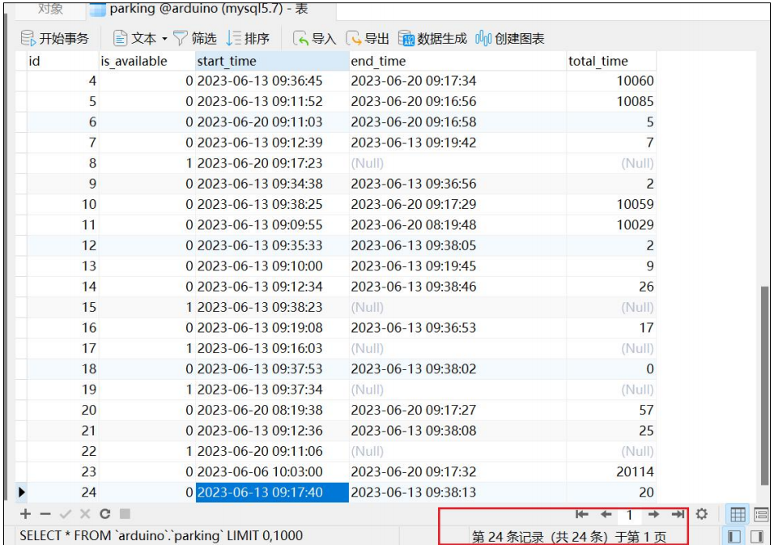

# 物联网数据服务平台 (IOT Data Service Platform)

物联网数据服务平台是一个集成了前端页面设计、服务器搭建、硬件设备控制以及数据处理等功能的全面系统。主要服务于物联网设备，例如用于查询停车位的设备。此项目使用HTML、CSS、JavaScript、Flask、Arduino和Python等技术。

## 主要功能

1. **前端页面实现**：使用HTML、CSS和JavaScript等技术构建前端页面，包括页面布局、交互设计以及页面功能实现等方面。通过前端页面，用户能够方便地进行停车位查询。
2. **Flask服务器实现**：使用Flask框架搭建服务器，实现前后端数据交互、数据库操作等功能。利用Flask的路由、模板以及表单处理等特性完成Web应用的开发。
3. **Arduino程序**：编写Arduino程序来控制硬件设备，包括传感器数据的读取、执行控制指令等。同时，介绍了如何在Arduino程序中使用串口通信，与外部设备进行数据交互。
4. **Arduino与Python程序交互**：详细介绍了如何编写Python程序与Arduino程序进行通信，实现数据的传输和处理。讨论了如何使用Python的串口库serial进行数据读取和发送，以及如何在Python程序中处理传感器数据和控制指令等。

## 测试

数据库整体数据

6 号车位无车变有车

数据库数据更新

前端页面改变

改变前

改变后

8 号车位有车变无车

数据库数据更新

前端页面改变

改变前

改变后

